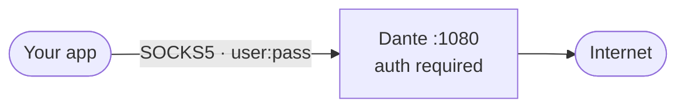
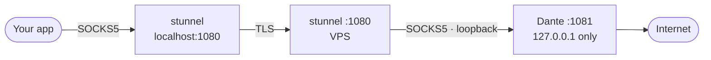

# dante-proxy

[](https://hub.docker.com/r/banfen321/dante-proxy)
[](https://github.com/banfen321/dante-proxy/actions/workflows/docker.yml)
[](LICENSE)

Private SOCKS5 proxy on [Dante](https://www.inet.no/dante/) — drop it on any VPS and connect in 30 seconds. No config files to edit: the container auto-detects your network interface and generates a strong password on first start.

## Quick start

```bash
git clone https://github.com/banfen321/dante-proxy.git
cd dante-proxy
docker compose up -d
docker compose logs dante   # grab the generated password
```

```bash
curl --socks5-hostname user:password@YOUR_HOST:1080 https://ifconfig.me
```

> **Cloud servers** — open the port in the firewall too. See [Cloud firewall](#cloud-firewall).

## How it works

**Default mode** — SOCKS5 with password auth, plaintext:



**TLS mode** (`--profile tls`) — traffic and credentials encrypted end-to-end:



Dante binds to `127.0.0.1` only — not reachable from outside without TLS.

## Configuration

Copy `.env.example` to `.env` and set your values. All variables are optional.

| Variable | Default | Description |
|---|---|---|
| `SOCKD_PORT` | `1080` | Listening port |
| `SOCKD_BIND_ADDR` | `0.0.0.0` | Bind address. Set `127.0.0.1` in TLS mode |
| `SOCKD_USER_NAME` | `proxy` | Username |
| `SOCKD_USER_PASSWORD` | *(auto-generated 24 chars)* | Password — printed to logs on first start |
| `SOCKD_EXTERNAL_IFACE` | *(auto-detected)* | Outbound network interface |
| `SOCKD_ALLOW_IPS` | `0.0.0.0/0` | Allowed client CIDR. Set to your IP to block everyone else |
| `STUNNEL_PORT` | `1080` | Public TLS port (TLS mode only) |

## TLS mode

Start the stunnel wrapper alongside Dante:

```bash
# .env
SOCKD_BIND_ADDR=127.0.0.1
SOCKD_PORT=1081
STUNNEL_PORT=1080
```

```bash
docker compose --profile tls up -d
```

A self-signed certificate is generated automatically on first start and stored in a Docker volume. To use your own certificate, mount `server.pem` and `server.key` at `/etc/stunnel/certs/`.

**Client setup** (stunnel on your machine):

```ini
# stunnel.conf
[socks5-tls]
client  = yes
accept  = 127.0.0.1:1080
connect = YOUR_HOST:1080
```

```bash
stunnel stunnel.conf
curl --socks5-hostname user:password@127.0.0.1:1080 https://ifconfig.me
```

## IP allowlist

Restrict which IPs can reach the proxy:

```env
SOCKD_ALLOW_IPS=203.0.113.42/32
```

Default is `0.0.0.0/0` — any IP can attempt to authenticate.

## Security

| | Default | With options |
|---|---|---|
| Password auth (PAM) | ✅ | ✅ |
| No root at runtime | ✅ | ✅ |
| `cap_drop: ALL` | ✅ | ✅ |
| CVE-2024-54662 patched | ✅ | ✅ |
| Traffic encrypted | ✗ | ✅ `--profile tls` |
| IP allowlist | ✗ | ✅ `SOCKD_ALLOW_IPS` |

Recommended setup for a public VPS — all three layers:

```env
SOCKD_BIND_ADDR=127.0.0.1
SOCKD_PORT=1081
STUNNEL_PORT=1080
SOCKD_ALLOW_IPS=<your-ip>/32
```

```bash
docker compose --profile tls up -d
```

## Cloud firewall

OS firewall alone is not enough on cloud providers — open the port in the control panel too.

**Oracle Cloud** — OCI Console → Networking → VCN → Security Lists → Add Ingress Rule: TCP `1080` from `0.0.0.0/0`

**AWS** — EC2 → Security Groups → Inbound rules → Add rule: Custom TCP `1080` from `0.0.0.0/0`

**Hetzner** — Firewall → Inbound rules: TCP `1080` from `0.0.0.0/0`

## Management

```bash
docker compose logs -f dante          # live connection log
docker compose pull && \
  docker compose up -d                # update to latest image
docker compose down                   # stop
```

## License

MIT — see [LICENSE](LICENSE).
